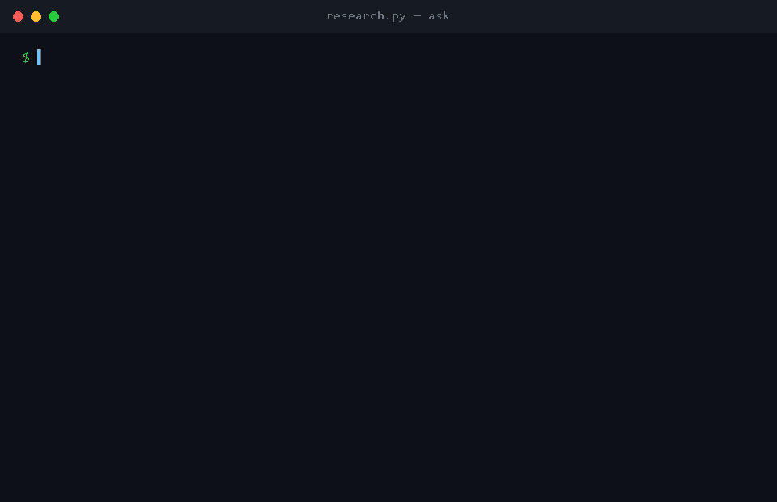

# research-engine

[English](#english) · [Русский](#русский)

<a id="english"></a>
## English

**A local-first research agent with a growing memory** — an exploration of how far you can take agentic research tooling using nothing but the Python standard library, two swappable LLM backends, and empirical verification at every step (live API smoke tests over trusting docs, real cross-process runs over unit tests, real bugs found via logs over speculative fixes).

### What it does

Point it at a research question. It autonomously decides which of 8 tools to call — OpenAlex (250M+ papers), CORE (open fulltexts), Brave Search, or its own accumulating local corpus — reads what it finds, and writes a cited report. Every run enriches a local SQLite corpus, so a second query on a related topic is served instantly from cache, no external API calls needed.


*Real output from a real run — see [docs/make_demo_gif.py](docs/make_demo_gif.py) for how this was captured (not a screen recording; see the note there for why).*

### Architecture

- **Two interchangeable LLM drivers** — DeepSeek (OpenAI-style tool calling) and Gemini (its newer Interactions API, whose real request/response shape was reverse-engineered against the live endpoint since the published docs were stale) share one tool implementation, so model comparisons run on identical footing.
- **Persistent corpus** (`corpus.py`) — SQLite with FTS5 full-text search, DOI/URL/OpenAlex-ID dedup, and a cache-first fulltext store. Verified across processes and across providers, not just unit-tested.
- **Local RAG** — paragraph-aware chunking, local embeddings via `llama-server` (no cloud embedding API), hybrid BM25+vector search merged with Reciprocal Rank Fusion, degrading gracefully to BM25-only when the embedding server isn't running.
- **Citation graph** — deterministic, built entirely from OpenAlex metadata already returned by normal search calls (including OpenAlex's own related-works similarity scoring, which meant no custom co-citation heuristic had to be built).
- **MCP server** (`mcp_server.py`) — a stdio JSON-RPC 2.0 server hand-implemented from the protocol spec (no `mcp` package, matching the project's stdlib-only constraint), exposing the corpus's read surface directly to Claude Code / opencode as native tools.

### Engineering highlights

- **Verified against live systems, not documentation.** Gemini's Interactions API shape didn't match what its docs described — caught via live smoke tests against a real key instead of trusting a fetched summary. Same discipline applied later to a genuine Claude Code product bug hit while wiring up the MCP server: traced to two matching upstream issues ([#9189](https://github.com/anthropics/claude-code/issues/9189), [#13389](https://github.com/anthropics/claude-code/issues/13389)) and a version-gated workaround confirmed against the actual docs rather than guessed from CLI flags.
- **Real empirical model comparison, not vibes**: matched-topic runs across DeepSeek and a 7-model Gemini zoo, cost/quality tradeoffs written up with sources — including a caught citation hallucination (a real DOI, attached to the wrong paper) traced back to a model that had skipped tool use entirely. See [comparisons/](comparisons/).
- **A real infrastructure bug, found and fixed, not just worked around**: the local embedding server was silently failing on chunks near ~575 tokens; root-caused via server logs to a too-small default batch size, fixed, and codified into the startup script so it can't regress.
- **The core design premise, quantified rather than assumed**: this project exists to keep expensive research legwork off a Claude Code session's own quota. Measured it directly — the identical research prompt run through `research.py` (DeepSeek) against the same prompt run through isolated `claude -p` sessions came out **23–46× more expensive** on Claude, with comparable output quality. Caught and fixed a real methodology bug along the way (a non-interactive session silently denying an unapproved tool instead of erroring — invisible unless you read the raw event stream). See [comparisons/2026-07-19-claude-vs-research-engine](comparisons/2026-07-19-claude-vs-research-engine/SUMMARY.md).
- **Scope discipline**: several roadmap items were deliberately deferred (LLM entity extraction, GraphRAG, path-finding over the citation graph) with the reasoning written down at the time, instead of building speculative abstractions ahead of actual need.

### Built in collaboration with Claude Code

This project was built pairing with an AI coding agent (Claude Code, running Claude Sonnet 5) across about a dozen sessions — every commit carries a `Co-Authored-By` line accordingly, visible as-is in the git history, nothing edited out. My role was direction, review, and the judgment calls — scope, security tradeoffs (what a local MCP server should and shouldn't expose), what to verify and how; the agent handled implementation and a fair share of the debugging, including tracking down the Claude Code approval bug above once redirected from guessing to actually searching for the answer. [ROADMAP.md](ROADMAP.md) (in Russian) is the unedited build log, phase by phase, dead ends included.

### Stack

Python 3, standard library + SQLite + `numpy` (the one deliberate exception, for brute-force cosine similarity — see ROADMAP for the reasoning). No cloud vector DB, no heavyweight ML framework — embeddings run locally via `llama-server`, CPU-only.

```
python research.py <prompt_file> <out_file>     # DeepSeek-driven research run
python research_gemini.py <prompt_file> <out_file>   # same, via Gemini
python research.py ask "question"               # answer from the local corpus only, no API calls
```

Full setup and reference docs are in the Russian section below, which is the authoritative version this project was actually built and documented in.

---

<a id="русский"></a>
## Русский

Исследовательский агент с двумя взаимозаменяемыми драйверами —
DeepSeek и Gemini (оба через нативный function calling): сам решает,
какие запросы слать в OpenAlex, CORE, Brave Search и в свой же
локальный корпус (`corpus.db`), читает найденные источники и пишет
итоговый отчёт по промпту. Каждый прогон обогащает корпус — второй
запрос по той же теме находит источники локально и мгновенно, без
похода во внешние API (см. Фазу 1 в [ROADMAP.md](ROADMAP.md)).

Выделен из [ggrs](https://github.com/zabrodschiipavel-sketch/ggrs)
(`tools/research_agent.py`) в самостоятельный инструмент, дальше
дообвязан локальным RAG (гибридный BM25+вектор поиск) и графом
цитирований — см. [ROADMAP.md](ROADMAP.md).

Исходный мотив — экономия квоты Claude: делегировать объёмное
исследование дешёвому внешнему драйверу вместо того, чтобы Claude Code
тратил токены сам. Проверено количественно на одинаковом промпте —
DeepSeek обошёлся **в 23–46 раз дешевле** прямого запроса через Claude,
при сопоставимом качестве отчёта — разбор в
[comparisons/2026-07-19-claude-vs-research-engine](comparisons/2026-07-19-claude-vs-research-engine/SUMMARY.md).

### Использование

```
python research.py <prompt_file> <out_file>          # DeepSeek
python research_gemini.py <prompt_file> <out_file>    # Gemini
```

`prompt_file` — текст задания для агента (что исследовать и в каком
формате вернуть отчёт). Результат пишется в `out_file`.

```
python research.py ask "вопрос"
```

Ответ ТОЛЬКО по накопленному корпусу (гибридный BM25+вектор поиск,
один синтезирующий вызов DeepSeek с цитатами) — без единого похода во
внешние API. Секунды, почти бесплатно. Требует эмбеддинг-сервер для
полноценного качества (см. «RAG» ниже) — без него тихо деградирует до
чистого BM25.



Реальный вывод реального прогона — как записано, см.
[docs/make_demo_gif.py](docs/make_demo_gif.py) (не скринкаст, причина
объяснена в комментарии сверху файла).

Оба драйвера используют один и тот же набор инструментов из
[sources.py](sources.py) (`search_corpus`, `search_openalex`,
`search_core`, `get_fulltext`, `search_brave`, `graph_cites`,
`graph_cited_by`, `graph_related`) — сравнение моделей получается на
равных условиях. Пример прогона обеих моделей на одинаковых темах —
[comparisons/2026-07-19-deepseek-vs-gemini](comparisons/2026-07-19-deepseek-vs-gemini/SUMMARY.md).

### Память между запусками

- `corpus.py` — SQLite (`corpus.db` рядом со скриптом, путь
  переопределяется `RESEARCH_CORPUS_PATH`). Всё, что находят
  `search_openalex`/`search_core`/`search_brave`, автоматически
  оседает в таблице `works` (дедуп по DOI/core_id/URL); `get_fulltext`
  сначала проверяет кэш и только потом идёт в CORE API. FTS5-индекс
  (`bm25`) даёт инструмент агента `search_corpus` — модели явно
  подсказано (`CORPUS_HINT`) проверять его до похода во внешние API.
- `trace.py` — полный лог каждого прогона в `runs/<run_id>/`:
  `meta.json` (провайдер/модель/usage/раунды) и `tool_calls.jsonl`
  (каждый вызов инструмента с аргументами и полным результатом).
  Локально, в `.gitignore` — не для коммита, для отладки.

И `runs/`, и `corpus.db` — чисто локальное состояние, ничего из этого
не публикуется. Подробности и сквозная проверка (два разных драйвера,
один и тот же корпус) — Фаза 1 в [ROADMAP.md](ROADMAP.md).

### RAG (Фаза 2)

Локальные эмбеддинги — `nomic-embed-text-v1.5` через `llama-server
--embedding` (мультиязычно, 768 измерений; модель уже была скачана
локально для LM Studio, отдельно ставить не надо):

```
powershell -File start-embed-server.ps1    # поднимает :8099
```

После этого в конце каждого прогона `trace.py` best-effort чанкует и
эмбеддит новые полные тексты (`chunking.py` + `embeddings.py` →
`chunks` в `corpus.db`) — сервер не поднят, чанкинг просто пропускается
с предупреждением, прогон не падает. `search_corpus` и `research.py
ask` используют `corpus.hybrid_search` — RRF-слияние BM25 и косинуса,
с деградацией до чистого BM25 при недоступном сервере.

Путь к серверу — `RESEARCH_EMBED_URL` (дефолт
`http://127.0.0.1:8099/v1/embeddings`, OpenAI-совместимый формат).
Gemini embeddings API как альтернатива — не реализовано, локальный
путь оказался достаточным.

### Граф цитирований (Фаза 3)

Детерминированный, без LLM — построен на полях OpenAlex, которые и так
приходят бесплатно вместе с `search_openalex` (`referenced_works` и
`related_works`, последнее — готовая оценка похожести от самого
OpenAlex, без своей co-citation эвристики):

- `graph_cites(doi)` — что работа цитирует; локально, бесплатно.
- `graph_related(doi)` — похожие работы по OpenAlex; локально, бесплатно.
- `graph_cited_by(doi)` — кто цитирует работу; **живой** запрос к
  OpenAlex (`filter=cites:...`), обогащает корпус найденными работами.

Все три принимают DOI (он уже есть в любом результате
`search_openalex`/`search_corpus`) — агент цепляет их естественно, без
дополнительного маппинга ID. LLM-извлечение сущностей, GraphRAG и
поиск путей между работами — сознательно не реализованы, см. Фазу 3 в
[ROADMAP.md](ROADMAP.md).

### MCP-сервер (Фаза 4)

Корпус доступен напрямую из Claude Code / opencode как MCP-сервер — не
через агентский цикл с DeepSeek/Gemini, а как обычные инструменты
клиента:

```
python mcp_server.py
```

Протокол (JSON-RPC 2.0 по stdio: `initialize`, `tools/list`,
`tools/call`, `ping`) реализован вручную, без пакета `mcp` — тот же
принцип stdlib-only, что и везде в проекте. Инструменты — только
READ-поверхность корпуса, 6 штук: `search_corpus`, `ask_corpus`
(синтезированный ответ с цитатами через DeepSeek — дороже и медленнее
обычного поиска), `graph_cites`, `graph_related`, `graph_cited_by`,
`get_fulltext`. `search_openalex`/`search_core`/`search_brave`
сознательно не включены — это инструменты, которые РАСТЯТ корпус
(`research.py`/`research_gemini.py`), а не читают его; смешение ролей
означало бы, что любой MCP-клиент может незаметно жечь лимиты Brave/CORE
просто листая библиотеку.

Регистрация (оба файла уже в репозитории, ничего дополнительно делать
не надо):

- **Claude Code** — [.mcp.json](.mcp.json) в корне репозитория.
- **opencode** — [opencode.json](opencode.json) в корне репозитория;
  тот же блок `mcp` можно продублировать в глобальном
  `~/.config/opencode/opencode.json`, если нужно видеть сервер вне
  этой директории.

Проверено вживую (не мок): подпроцесс-тест прогнал реальные
`initialize`/`tools/list`/`tools/call` по протоколу — настоящий
гибридный поиск по корпусу, настоящий граф цитирований (10 рёбер по
известному DOI), `get_fulltext` с реальным кэш-попаданием и один
настоящий вызов DeepSeek через `ask_corpus`, плюс обработка плохих
аргументов, неизвестного метода и битой JSON-строки без падения
сервера. Дальше — сквозная проверка живой сессией Claude Code
(`claude -p` со `stream-json` выводом): свежая сессия видит все 6
`mcp__research-engine__*` инструментов, реально вызывает
`search_corpus` и получает настоящие данные из корпуса.

Подхват конфига Claude Code тоже проверен вживую: `claude mcp list` /
`claude mcp get research-engine` изнутри репозитория видят сервер с
правильным command/args из `.mcp.json`. На Windows approval-диалог
project-scoped MCP-серверов может вообще не появиться при обычном
запуске `claude` — известный баг ([issue #9189](https://github.com/anthropics/claude-code/issues/9189),
[issue #13389](https://github.com/anthropics/claude-code/issues/13389),
второй воспроизведён именно на Windows). Если после интерактивного
`claude` в этой папке `claude mcp list` всё ещё показывает
`⏸ Pending approval`, обходной путь из официальных доков
(`code.claude.com/docs/en/mcp`, актуален для версий до v2.1.207) —
создать неотслеживаемый `.claude/settings.local.json`:

```json
{
  "enabledMcpjsonServers": ["research-engine"]
}
```

Файл уже в `.gitignore` — именно неотслеживаемость (git не видит файл
как tracked) и есть условие, при котором approval применяется даже без
прохождения trust-диалога. Проверено вживую — после этого `claude mcp
list` показывает `research-engine: ... - ✔ Connected` (реальный
health-check, не кэш). `opencode.json` таким же образом не
перепроверялся — свой клиент, свой флоу доверия.

### Секреты

Скопируйте `secrets.example.json` в `secrets.json` (лежит рядом со
скриптом, в `.gitignore`) и заполните ключи:

- `deepseek` — DeepSeek API key
- `openalex` — OpenAlex API key
- `core` — CORE API key
- `brave` — Brave Search API key (Free tier: 1 rps)
- `gemini` — Gemini Developer API key (ai.google.dev), нужен для `research_gemini.py`
- `vertex_express` — Vertex AI Express Mode key (пока нигде не используется, добавлен про запас)

Путь к секретам можно переопределить переменной окружения
`RESEARCH_SECRETS_PATH`.

Модель DeepSeek — переменная окружения `RESEARCH_MODEL`
(по умолчанию `deepseek-v4-pro`; при ошибке запроса автоматически
падает на `deepseek-v4-flash`).

Модель Gemini — `RESEARCH_GEMINI_MODEL` (по умолчанию `gemini-3.5-flash`).
Веб-поиск для Gemini по умолчанию идёт через тот же `search_brave`, что
и у DeepSeek: встроенный grounding-инструмент `google_search` на
бесплатном ключе отвечает `429` (тарифицируется отдельно, похоже,
нужен биллинг на проекте — см. `comparisons/.../SUMMARY.md`). Включить
его, если биллинг появится: `RESEARCH_GEMINI_SEARCH=google`.

Free tier Gemini держит немного запросов в минуту суммарно на ключ —
если гоняете DeepSeek- и Gemini-драйвер параллельно (или несколько тем
через Gemini одновременно), может словиться `429 too_many_requests`
даже без `google_search`; тогда просто повторить чуть позже.

### Зависимости

Стандартная библиотека Python 3 + `numpy` (brute-force косинус для
векторного поиска — единственное исключение из принципа «stdlib-only»,
осознанно допущенное в ROADMAP). Сам эмбеддинг-сервер (`llama-server`)
— отдельный бинарник, не Python-зависимость.
